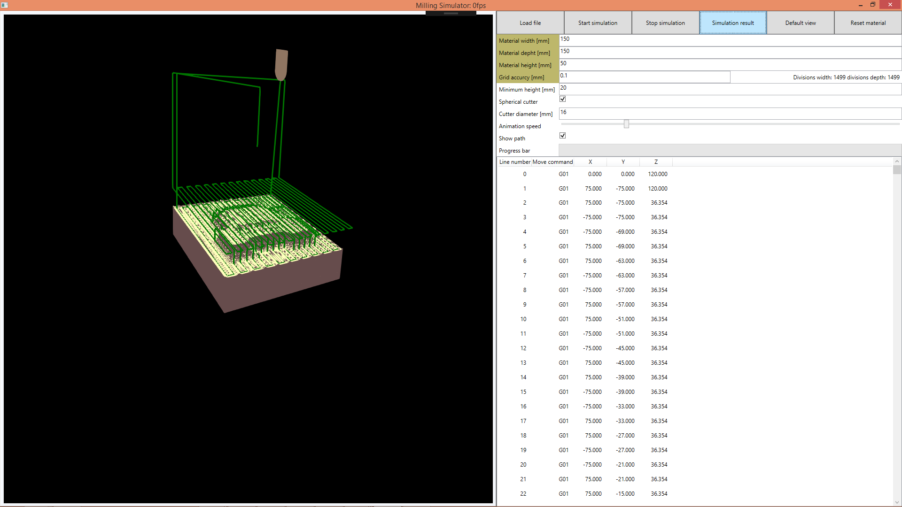

# Milling simulator
Aplikacja pozwala symulować zachowanie frezarki dla podanego pliku ze ścieżkami. Możliwa jest animowana symulacja jak również przeskok do końca, w celu szybkiego zobrazowania efektu pracy.

Aplikacja sprawdza czy dostarczony plik nie zawiera podstawowych błędów np. frezowanie frezem walcowym w dół lub frezowanie poniżej ustalonej głębokości minimalnej. W oknie podglądu można wyświetlać lub ukrywać wczytane ścieżki.

Efekt wykonania przygotowanej wcześniej w programie Modelowanie Geometryczne ścieżki zgrubnej.

Wygładzanie podstawki, strategia Zig-zag.

Wygładzanie konturów. 

Frezowanie dokładne

Frezowanie dokładne

